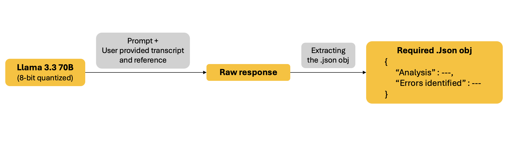

# Assessing Domain-Specific Automatic Speech Recognition (ASR) accuracy
This repository contains the python code for an LLM-based ASR evaluation pipeline

## Limitations of existing evaluation metrics

The transcription accuracy of ASR models is usually evaluated using metrics such as Word Error Rate (WER). A WER of 0 indicates that the ASR transcript is a perfect match to the reference and a WER of 1 indicates that the ASR transcript is completely incorrect. The main drawback of such metrics is their objective nature of assessment i.e., they do not consider the impact of the error on the meaning of the sentence, but rather treat all errors equally. 

For example:

```python
Reference = "Piedmont forty eight seventy two fly heading of one five zero"
ASR Transcript = "Piedmont forty eight seventy two fly heading of five zero"
```

| Metric                                    | Value                                    |
|-------------------------------------------|------------------------------------------|
| `WER (Lower is better)`                   | 0.091                                    |

Here, the ASR transcript contains every word in the reference except the word "one", hence **WER is low (0.091), indicating that the ASR transcript is close to being accurate.** However, the message conveyed by the ASR transcript is different than the reference. In the reference statement, the flight "Piedmont forty eight seventy two" is being instructed to fly a heading of "one five zero". On the other hand, in the ASR transcript, the same flight is being instructed to fly a heading of "five zero".

Since, omission of the word "one" resulted in a drastic change in the directional information, it can cause operational confusion. Hence, the ASR transcript is **HIGHLY INACCURATE.**

## Proposed alternative

To consider the contextual importance of errors in words when evaluating the accuracy of an ASR transcription, a Large Language Model (LLM) can be used to compare an ASR generated transcript and a reference statement. Since LLMs excel at instruction following, they can be tasked to not only identify the error(s) in an ASR transcript, but also to determine the criticality of the identified error(s).

The **Qwen3-30B-A3B** model was selected for implementing prompting with few-shot learning to develop an **LLM-based ASR Evaluation Pipeline** that takes an ASR transcript and a reference statement as inputs, and returns a response containing the identified word error(s) and the impact of this(these) error(s).


## Table of Contents
  - [LLM-Based ASR Evaluation Pipeline](#llm-based-asr-evaluation-pipeline)
  - [Files overview](#files-overview)
  - [Initial Setup](#initial-setup)
    - [Installing Required Packages](#installing-required-packages)
    - [Getting a HuggingFace Access Token](#getting-a-huggingface-access-token)
    - [About the Qwen3-30B-A3B model](#about-the-qwen3-30b-a3b-model)
  - [Usage Instructions](#usage-instructions)
    - [Providing the Input](#providing-the-input)
    - [Generating the Output](#generating-the-output)
  - [Sample Output](#sample-output)
  - [Acknowledgement](#acknowledgement)


## LLM-Based ASR Evaluation Pipeline



1. **Prompt →** A detailed instruction for the LLM to compare the user-provided ASR transcript and reference statement, and generate the required output. The prompt also contains 8-10 sample input-output pairs *(few-shot examples)*
2. **Output format →** The raw output generated by the LLM is processed to extract the .json object containing two fields:
   - **Analysis :** A detailed explanation of the error(s) identified in the transcript when compared with the reference statement and whether it(they) substantially change the core message conveyed
   - **Error(s) Identified :** A list of strings of the type(s) of error(s) identified. For example, ["Key information error"] (see below). If there are no error, the identified list will be empty.
     - *"Callsign error"* = A word omission or substitution or addition has resulted in a change in the aircraft identifier
     - *"Key information error"* = A word omission or substitution or addition has resulted in loss of critical information or loss of a key piece of information such as the heading, altitude, speed, runway, tower frequency, traffic advisories or other essential instructions
     - *"Minor error"* = A word omission or substitution or addition has resulted in no change in the key instruction conveyed

## Files overview

1. Inputs.json → Contains the user provided input. Ref [Providing the Input](#providing-the-input)
2. Evaluation_script.py → Contains main script to run the evaluation pipeline and generate the required .json object

## Initial Setup

### Installing Required Packages
A **virtual environment** is an isolated space on your computer where you can install Python packages without affecting the rest of your system. It keeps dependencies for different projects separate.

Use `pip` to install the required packages:

```bash
pip install torch transformers accelerate huggingface_hub
```

### Getting a HuggingFace Access Token
[Hugging Face](https://huggingface.co/) is an online platform hosting machine learning models and datasets. We use it to download and run the **Meta LLaMA-3 70B Instruct** model.

1. Sign up or log in at https://huggingface.co/.  
2. Click on your profile → **Settings** → **Access Tokens**.  
3. Create a **New Token** (give it a name like `faa-cer-token`).  
4. Copy the token string—you need to paste it into your code in the next steps.

In the Evaluation_script.py file, paste your access token

```python
access_token = "paste_your_token_here"
```

### About the Qwen3-30B-A3B model

- It is a **Mixture of Experts (MoE)** model primarily used for **text-generation**. It is trained on a wide variety of data *(Books and academic texts, Mathematics and reasoning tasks, dialogues and instructions)*
- This LLM contains **~30 billion parameters**. However, during inference time, only **~3.3 billion parameters** are activated.

The model automatically distributes jobs across available GPUs on your computer via `device_map="auto"`.


## Usage Instructions

### Providing the Input

Your input JSON file should follow this format:

```json
[
  {
    "reference": "Endeavor forty one thirty two continue for three three left we can circle to land for two seven",
    "transcription": "Endeavor forty one thirty two continue for three three left we can sir cull to land for two seven"
  }
]
```

### Generating the Output

To evaluate the contextual error rate, simply run:

```bash
python Evaluation_script.py
```

The script will read your input .JSON file, evaluate each [reference statement-transcription] pair using the LLM, and output a new file containing:

- `"analysis"`  
- `"errors_identified"`  

---

## Sample Output

```json
{
  "analysis": "On comparing the transcript with the reference, the substitution of the word 'circle' with 'sir cull' in the transcript introduces a significant error. 'Sir cull' is not a valid phrase in ATC communications and appears to be a mishearing or mispronunciation of 'circle'. This changes the meaning of the instruction, as 'circle' is a standard ATC clearance for an aircraft to perform a traffic pattern or a holding maneuver. The error in 'circle' is a key information error as it alters the core instruction given by the controller.",
  "errors_identified": ["Key information error"],
}
```


## Acknowledgement

This **LLM-based ASR evaluation pipeline** was developed as part of the FAA’s research into reliable automatic speech recognition (ASR) systems for ATC environments.
